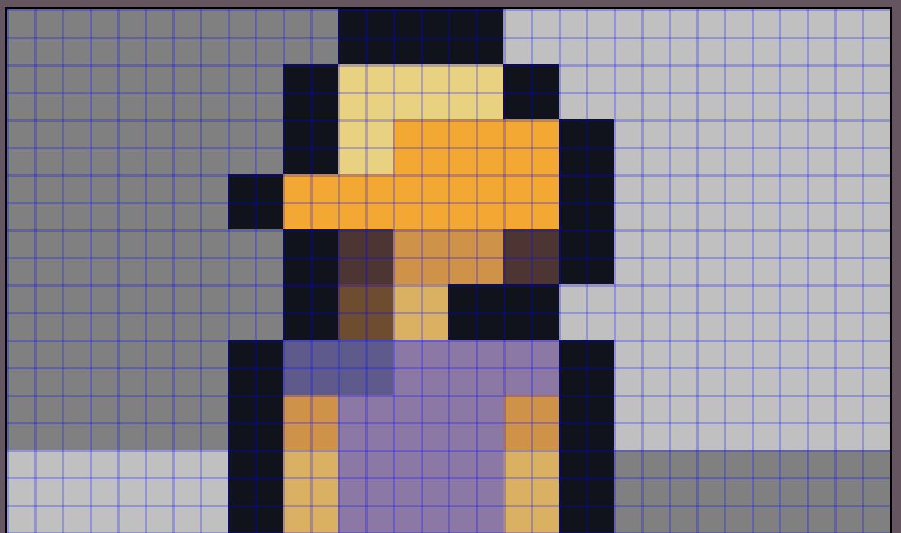
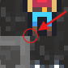

# Why A World Below is no longer pixel perfect

Yes, as the title suggests, A World Below is no longer pixel perfect. This may disappoint some of you, but it definitely was the right decision for me to make.

## Why
A World Below had a pretty big issue: movement. While it wasn't very apparent when looking at video footage of the game, when playing it was pretty obvious. There was no acceleration and no deceleration when moving horizontally. That was because the game's engine moved everything in full pixels, and if it didn't, the moving entities would stand between pixels.

This would not have been an issue for most games, but it was for A World Below because of its unique player-to-screen proportion and its small virtual screen size. When I allowed sub-pixel movement, the players would jitter around on the screen and my eyes would start to hurt.

## The solution
There were 2 solutions for the problem: 
1. **Making the player sprites bigger.**
My players are relatively small compared to the screen size; that meant that they had to move a lot in the sub-pixel space, or else their speeds would be disproportionate to their size.
2. **Allow sub-pixel movement.** This would allow pixels to overlap. 

### The Choice
I decided to go for option 2. The biggest reason was that I suck at making art. I tried to make the player sprites bigger, but I miserably failed. The game has to fit my skills, or else I'd probably give up sooner or later.

### The Process
First I doubled the screen size and zoomed in with the camera. This meant that each pixel on the textures is now represented by 4 pixels on the screen.

This image shows what the new pixel size would look like on Jennifer, with the blue grid showing actual pixels. *(btw I'm not 100% settled on naming her Jennifer; I need suggestions!!)*

Now everything was smooth even with sub pixel movement. That did not satisfy me though, as I didn't like how you could clearly see the pixels overlapping, as shown in the screenshot below.

My fix for this was to snap the position of all moving entities to the pixel grid once their velocity reached 0. This solution turned out to be very effective at hiding the subpixel rendering and it has been in use in A World Below ever since I first implemented it.

## Conclusion
Experiment with different ideas until you find something you like. That was the main lesson I learned from spending the last 2 weeks on this. See what other games do, try it out, and if it works, it works. If not, try something different.

## Last words
That was it for the first blog post on my new website and the first blog post on A World Below. I hope you enjoyed reading it. Leave a comment if you want and have a nice rest of your day.